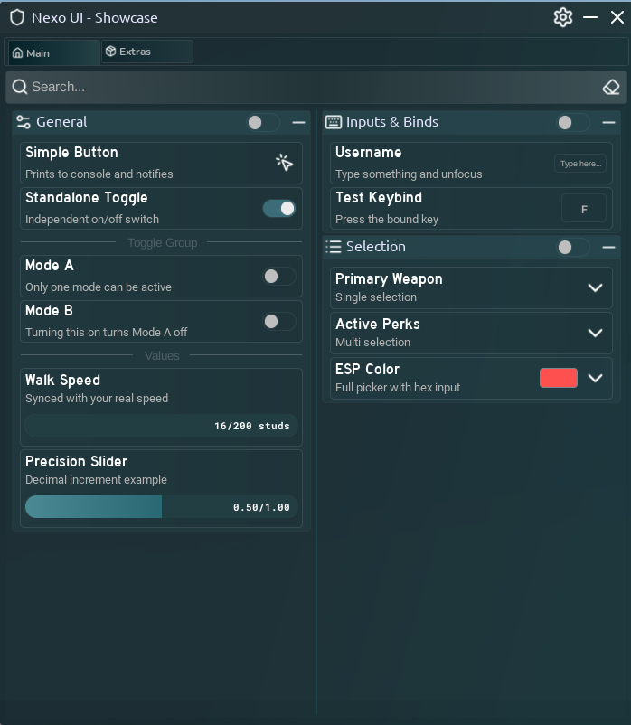

# Nexo UI

A UI library for Roblox scripts. Single file, no dependencies. Comes with a built-in settings page, theme system, config saving and a notification system so you don't have to build any of that yourself.



## Getting started

```lua
local Nexo = loadstring(game:HttpGet("https://raw.githubusercontent.com/yriri842/UILibrary/refs/heads/main/library.lua"))()

local Window = Nexo.CreateWindow({
    Title = "My Script",
    Icon = "shield", -- lucide icon name, asset id, or rbxassetid:// string
    Size = UDim2.fromOffset(700, 800),
})
```

The window comes with dragging, resizing (bottom right corner), a minimize button, a search bar that filters components on the current tab, and a settings page behind the gear icon in the topbar. You don't need to set any of that up.

Icons can be passed three ways: a lucide icon name like `"save"`, a raw asset id like `10734950309`, or a full `"rbxassetid://..."` string.

## Tabs and categories

Everything lives inside a category, and categories live inside tabs. Each tab has two columns, pick one with `Side`.

```lua
local Main = Window:AddTab({ Title = "Main", Icon = "home" })

local Movement = Main:AddCategory({
    Title = "Movement",
    Icon = "footprints",
    Side = "Left",       -- "Left" or "Right"
    Collapsed = false,   -- start collapsed
    Locked = false,      -- start locked (blocks interaction)
})
```

Categories can be collapsed with the arrow in their header, and locked with the small switch next to it. Locking greys the category out and blocks input, which is handy for features that shouldn't be touched while something else is running.

## Components

All components share the same basic config: `Title`, `Description` (optional) and `Tooltip` (optional, shows on hover). Components that hold a value also accept `Flag`, which is what the config system uses to save and restore them. If you want a value to persist, give it a flag.

### Button

```lua
Movement:AddButton({
    Title = "Reset Character",
    Description = "Kills your character",
    Icon = "skull",
    Callback = function()
        game.Players.LocalPlayer.Character.Humanoid.Health = 0
    end,
})
```

### Toggle

```lua
Movement:AddToggle({
    Title = "Speed Boost",
    Default = false,
    Flag = "speedBoost",
    Callback = function(value)
        print("toggled:", value)
    end,
})
```

Toggles support groups. Give several toggles the same `Group` string and turning one on turns the others off, like a radio button.

### Slider

```lua
Movement:AddSlider({
    Title = "Walk Speed",
    Min = 16,
    Max = 200,
    Default = 16,
    Increment = 1,
    Suffix = " studs",
    Flag = "walkSpeed",
    Callback = function(value)
        game.Players.LocalPlayer.Character.Humanoid.WalkSpeed = value
    end,
    -- optional: keep the slider in sync with the real value.
    -- if the game resets your speed, the slider follows.
    Watch = function()
        return game.Players.LocalPlayer.Character.Humanoid.WalkSpeed
    end,
})
```

### Input

```lua
Movement:AddInput({
    Title = "Target Name",
    Placeholder = "username",
    Default = "",
    ClearOnFocus = false,
    Callback = function(text)
        print(text)
    end,
})
```

The callback fires when the box loses focus.

### Keybind

```lua
Movement:AddKeybind({
    Title = "Toggle Fly",
    Default = Enum.KeyCode.F,
    Callback = function(key)
        -- fires when the key is pressed
    end,
    ChangedCallback = function(key)
        -- fires when the user rebinds it
    end,
})
```

Click the key box, press a key, done. All keybinds are also listed in the on-screen keybind overlay, which the user can enable from Settings > Behavior.

### Dropdown

```lua
Movement:AddDropdown({
    Title = "Primary Weapon",
    Values = { "Sword", "Bow", "Spear" },
    Default = "Sword",
    Multi = false,       -- true allows multiple selections
    Searchable = true,   -- adds a search bar inside the dropdown
    Callback = function(selected)
        -- string in single mode, table of strings in multi mode
        print(selected)
    end,
})
```

### Color picker

```lua
Movement:AddColorPicker({
    Title = "ESP Color",
    Default = Color3.fromRGB(255, 0, 0),
    Callback = function(color)
        print(color)
    end,
})
```

Expands into a full picker with a palette, hue and darkness sliders, preset swatches and a hex input.

### Separator

```lua
Movement:AddSeparator({ Text = "Combat" })
```

Just a labeled line for splitting a category into sections.

## Component methods

Every component returns an object. What's on it depends on the component, but the common ones are:

```lua
local toggle = Movement:AddToggle({ ... })

toggle:Set(true)        -- set value, fires callback
toggle:Set(true, true)  -- second arg true = silent, no callback
toggle:Get()            -- read current value
toggle:SetTitle("New title")
toggle:SetDescription("New description")
toggle:SetVisible(false)
toggle:Destroy()
```

## Notifications

```lua
local notif = Window:Notify({
    Title = "Done",
    Content = "Settings loaded successfully.",
    Icon = "check",     -- optional
    Duration = 5,       -- seconds, defaults to 5
    Callback = function()
        -- runs if the user clicks the notification
    end,
})

-- you can also update or close it early
notif:SetContent("Actually, hold on...")
notif:Close()
```

Notifications slide in from the bottom left and dismiss themselves when the timer bar runs out, or when clicked.

## Configs

Anything with a `Flag` gets picked up by the config system automatically. There's a full config menu in the settings page already (save, load, refresh, JSON import/export), but you can also drive it from code:

```lua
Window:SaveConfig("my-config")
Window:LoadConfig("my-config")

local json = Window:ExportConfig()   -- returns a JSON string
Window:ImportConfig(json)
```

Configs are written to the `NexoUI` folder via writefile when available. In Studio or environments without file access they're kept in memory for the session instead.

## Themes

Five presets ship with the library: `Default`, `Dark`, `Light`, `Midnight`, `Amoled`. Users can switch them from the settings page, or you can do it from code:

```lua
Window:SetThemePreset("Midnight")
Window:SetAccent(Color3.fromRGB(255, 100, 100))
Window:SetThemeColor("PrimaryText", Color3.new(1, 1, 1))
```

The settings page also has a Custom Theme category where users can recolor the window piece by piece, and export the result as JSON to share it. To load a shared theme:

```lua
Window:ImportTheme(jsonString)
```

You can also pass theme overrides when creating the window:

```lua
local Window = Nexo.CreateWindow({
    Title = "My Script",
    Theme = {
        Accent = Color3.fromRGB(200, 80, 255),
    },
})
```

## Window methods

```lua
Window:Show()
Window:Hide()
Window:ToggleVisibility()
Window:SetTitle("New Title")
Window:SetKeybindListVisible(true)
Window:UnloadGui()  -- removes everything

-- if you need to add your own stuff to the settings page:
local settings = Window.GetSettingsTab()
local myCat = settings:AddCategory({ Title = "Extras", Side = "Left" })
```

## Notes

- The library uses `gethui()` when it exists and falls back to PlayerGui, so it works both in executors and in Studio.
- Lucide icons are fetched from a remote module outside Studio. If that fails, icons passed by name just won't render, everything else keeps working.
- Search matches against component titles, descriptions and category names on the active tab.
